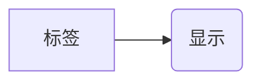
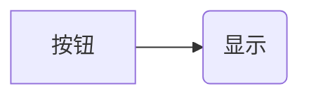
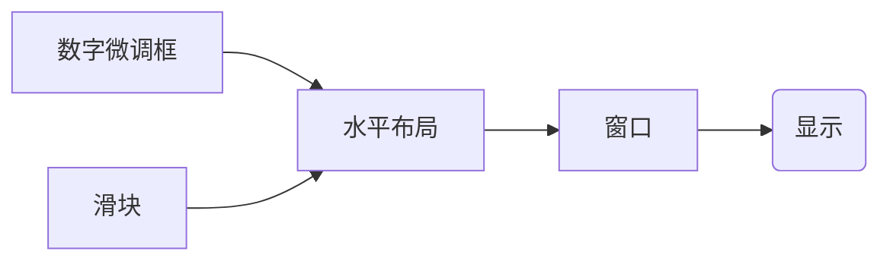
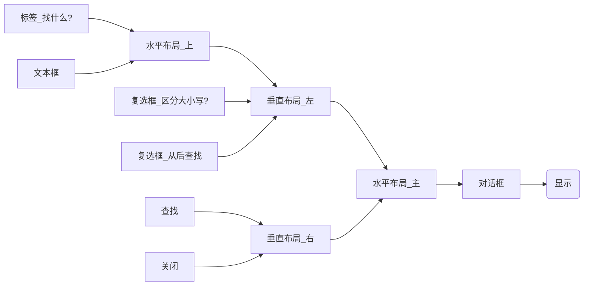
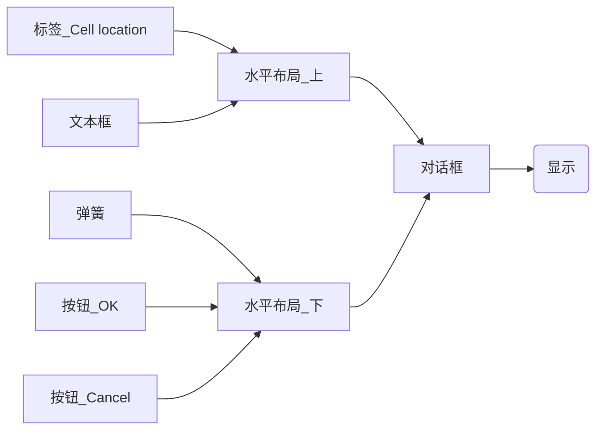
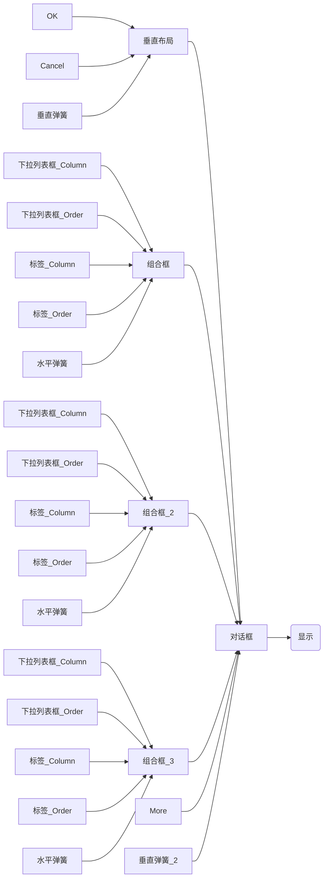

# Demo
##代码
### main.cpp
``` c++
#include <QApplication>
#include<QLabel>
int main(int argc, char *argv[])
{
    QApplication a(argc, argv);
    QLabel *l=new QLabel("Hello,QT!");
    l->show();
    return a.exec();
}
```
## 结构




##输出


# Demo2
##代码
###main.cpp
``` c++
#include <QApplication>
#include<QPushButton>
int main(int argc, char *argv[])
{
    QApplication a(argc, argv);
    QPushButton *button =   new QPushButton("quit");
    QObject::connect(button,SIGNAL(clicked()),&a,SLOT(quit()));//信号->槽 机制
    button->show();
    return a.exec();
}
```
## 结构




##输出


#Demo3
##代码
###main.cpp
``` c++
#include"mainwindow.h"
#include<QApplication>
#include<QHBoxLayout>
#include<QSlider>
#include<QSpinBox>
int main(int argc, char *argv[])
{
    QApplication a(argc, argv);
    QWidget *window  =new QWidget;          //创建窗口
    window->setWindowTitle("HELLO");        //设置标题
    QSpinBox *spinbox=new QSpinBox;         //创建数字微调框
    spinbox->setValue(30);  spinbox->setRange(0,100);
    QSlider *slider= new QSlider(Qt::Horizontal);//创建滑块
    slider->setRange(0,100);slider->setValue(30);
    QHBoxLayout *layout=new QHBoxLayout;    //创建水平布局
    layout->addWidget(spinbox);     layout->addWidget(slider);//将滑块和数字微调框添加进水平布局中
    QObject::connect(slider,SIGNAL(valueChanged(int )),spinbox,SLOT(setValue(int )));//建立滑块和数字微调框之间的联系（信号->槽）
    QObject::connect(spinbox,SIGNAL(valueChanged(int)),slider,SLOT(setValue(int )));
    window->setLayout(layout);//将水平布局放入建立的窗口
    window->show();             //显示窗口
    return a.exec();
}

```
## 结构




##输出


#Demo4
##代码
###finddialog.h
``` c++
#ifndef FINDDIALOG_H
#define FINDDIALOG_H
#include<QDialog>//系统对话框类

class QWidget;      //声明窗口
class QLabel;       //声明标签
class QLineEdit;    //声明文本框
class QCheckBox;    //声明勾选框
class QPushButton;  //声明按钮


class FindDialog: public QDialog        //继承系统对话框
{
    Q_OBJECT
    public:
        FindDialog(QWidget* parent =0); //构造函数

    signals://信号
        void findNext(const QString &str,Qt::CaseSensitivity cs);       //向后找
        void findPrevious(const QString &str,Qt::CaseSensitivity cs);   //向前找

    private slots://槽
        void  enableFindButton(const QString &text);//响应FindButton的亮熄
        void  findClicked();                        //响应查找

    private:                            //私有成员
        QLabel* label;
        QLineEdit* lineEdit;
        QCheckBox* caseCheckBox;
        QCheckBox* backwardCheckBox;
        QPushButton* findButton;
        QPushButton* closeButton;
};

#endif // FINDDIALOG_H

```
###finddialog.cpp
``` c++
#include<QtWidgets>                     //窗口部件库
#include "finddialog.h"

FindDialog::FindDialog(QWidget *parent) :QDialog(parent)  //构造函数的具体定义
{                                         //建立部件
    label = new QLabel(tr("找什么(&W):"));
    lineEdit = new QLineEdit;
    label->setBuddy(lineEdit);

    caseCheckBox = new QCheckBox(tr("区分大小写(&C)"));
    backwardCheckBox = new QCheckBox(tr("从后查找(&B)"));

    findButton = new QPushButton(tr("查找"));
    findButton->setDefault(true);
    findButton->setEnabled(false);

    connect(lineEdit,SIGNAL(textChanged(QString)),this,SLOT(enableFindButton(QString)));
    connect(findButton,SIGNAL(clicked()),this,SLOT(findNext(QString,Qt::CaseSensitivity)));

    closeButton = new QPushButton(tr("关闭"));

    connect(closeButton,SIGNAL(clicked()),this,SLOT(close()));
                                            //建立布局
    QHBoxLayout * topLeftLayout = new QHBoxLayout;
    topLeftLayout->addWidget(label);
    topLeftLayout->addWidget(lineEdit);

    QVBoxLayout * leftLayout = new QVBoxLayout;
    leftLayout->addLayout(topLeftLayout);
    leftLayout->addWidget(caseCheckBox);
    leftLayout->addWidget(backwardCheckBox);

    QVBoxLayout *rightLayout = new QVBoxLayout;
    rightLayout->addWidget(findButton);
    rightLayout->addWidget(closeButton);
    rightLayout->addStretch();//填充空白

    QHBoxLayout *mainLayout = new QHBoxLayout;
    mainLayout->addLayout(leftLayout);
    mainLayout->addLayout(rightLayout);

    setLayout(mainLayout);

    setWindowTitle(tr("Find"));
    setFixedHeight(sizeHint().height());//自适应高度

}

void FindDialog::enableFindButton(const QString &text)
{
    findButton->setEnabled(!text.isEmpty());
}

void FindDialog::findClicked()
{
    QString text = lineEdit->text();
    Qt::CaseSensitivity cs = caseCheckBox->isChecked()? Qt::CaseSensitive :  Qt::CaseInsensitive;
    if(backwardCheckBox->isChecked())
    {
        emit findPrevious(text,cs);
    }
    else
    {
        emit findNext(text,cs);
    }
}

```
###main.cpp
``` c++
#include<finddialog.h>
#include <QApplication>

int main(int argc, char *argv[])
{
    QApplication a(argc, argv);
    FindDialog *diglog = new FindDialog;
    diglog->show();
    return a.exec();
}

```
## 结构




##输出


#Demo5
##代码
###dialog.h
``` c++
#ifndef DIALOG_H
#define DIALOG_H

#include <QDialog>

QT_BEGIN_NAMESPACE
namespace Ui { class Dialog; }
QT_END_NAMESPACE

class Dialog : public QDialog
{
    Q_OBJECT

public:
    Dialog(QWidget *parent = nullptr);
    ~Dialog();

private:
    Ui::Dialog *ui;
};
#endif // DIALOG_H

```
###dialog.cpp
``` c++
#include "dialog.h"
#include "ui_dialog.h"

Dialog::Dialog(QWidget *parent)
    : QDialog(parent)
    , ui(new Ui::Dialog)
{
    ui->setupUi(this);
}

Dialog::~Dialog()
{
    delete ui;
}

```
###main.cpp
``` c++
#include "dialog.h"

#include <QApplication>

int main(int argc, char *argv[])
{
    QApplication a(argc, argv);
    Dialog w;
    w.show();
    return a.exec();
}

```
### dialog.ui


## 结构




##输出


#Demo6
##代码
###dialog.h
``` c++
#ifndef DIALOG_H
#define DIALOG_H

#include <QDialog>

QT_BEGIN_NAMESPACE
namespace Ui { class Dialog; }
QT_END_NAMESPACE

class Dialog : public QDialog
{
    Q_OBJECT

public:
    Dialog(QWidget *parent = nullptr);
    ~Dialog();
    void setColumnRange(QChar frist ,QChar last);

private:
    Ui::Dialog *ui;
};
#endif // DIALOG_H

```
###dialog.cpp
``` c++
#include "dialog.h"
#include "ui_dialog.h"

Dialog::Dialog(QWidget *parent)
    : QDialog(parent)
    , ui(new Ui::Dialog)
{
    ui->setupUi(this);
    ui->groupBox_2->hide(); //隐藏框2和框3
    ui->groupBox_3->hide();
    this->layout()->setSizeConstraint(QLayout::SetFixedSize);//窗口布局自适应
    setColumnRange('A','Z');
}

Dialog::~Dialog()
{
    delete ui;
}

void Dialog::setColumnRange(QChar frist,QChar last)//添加选项
{
    ui->comboBox->clear();
    ui->comboBox_3->clear();
    ui->comboBox_5->clear();
    ui->comboBox_3->addItem("None");
    ui->comboBox_5->addItem("None");
    QChar ch=frist;
    while(ch<=last)
    {
        ui->comboBox->addItem(QString(ch));
        ui->comboBox_3->addItem(QString(ch));
        ui->comboBox_5->addItem(QString(ch));
        ch=ch.unicode()+1;
    }
}

```
###main.cpp
``` c++
#include "dialog.h"

#include <QApplication>

int main(int argc, char *argv[])
{
    QApplication a(argc, argv);
    Dialog w;
    w.show();
    return a.exec();
}

```
### dialog.ui


## 结构




##输出


